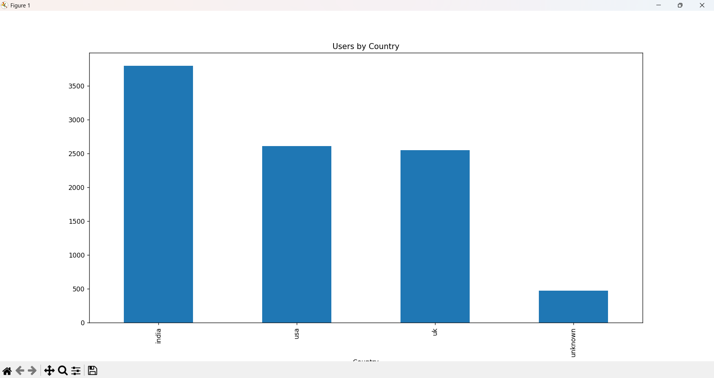
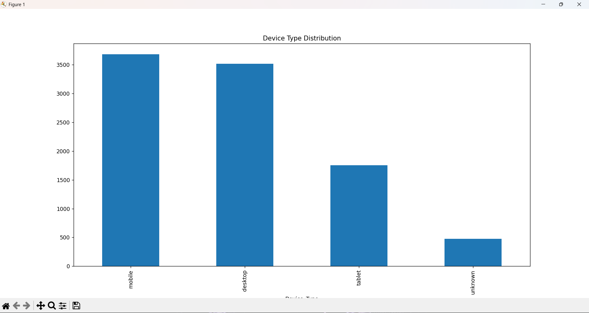
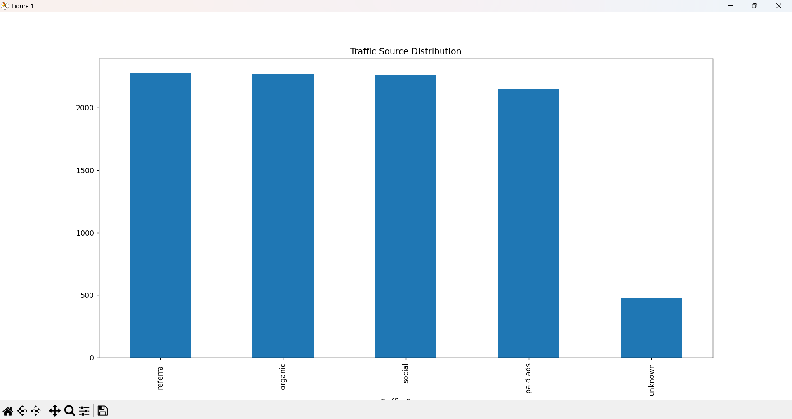
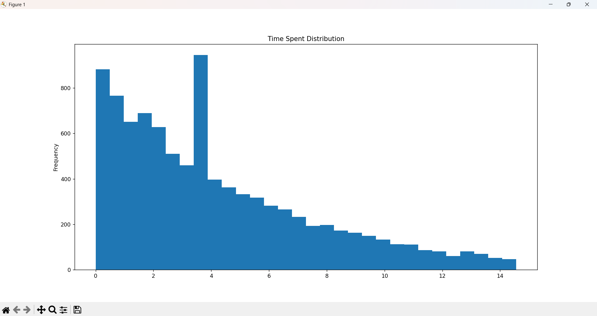
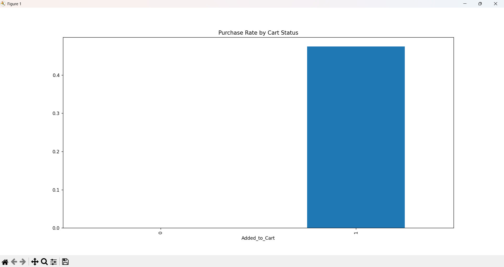
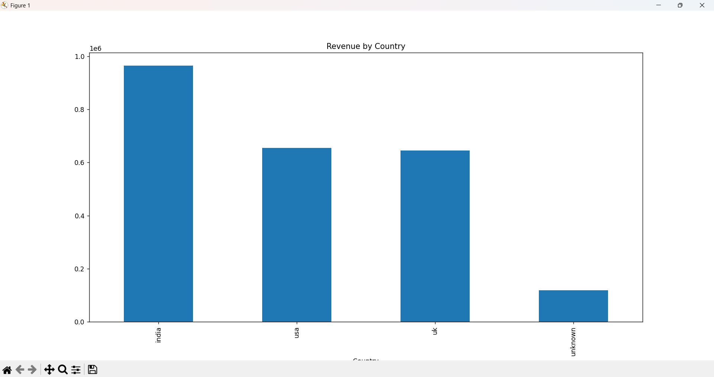
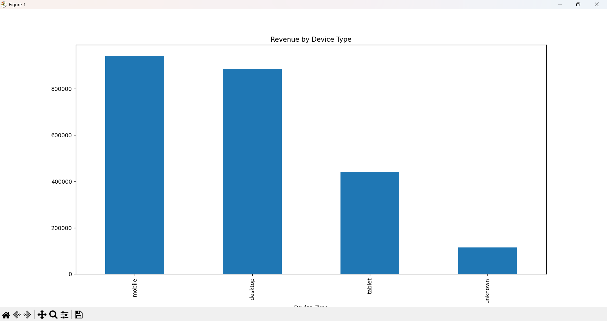

# 📊 E-Commerce User Behavior Analysis (Python EDA Project)

## 🧠 Project Overview

This project performs **Exploratory Data Analysis (EDA)** on an e-commerce dataset to understand user behavior, engagement patterns, conversion funnel, and revenue insights using Python.

The dataset was initially messy and required extensive data cleaning, including:

* Handling missing values
* Standardizing categorical variables
* Treating outliers using IQR method
* Fixing logical inconsistencies in user actions

---

## 🎯 Objective

To analyze how users interact with the platform and identify:

* Engagement patterns
* Conversion behavior (Cart → Purchase)
* High-performing segments (Country, Device, Traffic Source)

---

## 🛠️ Tools & Technologies

* Python
* Pandas
* NumPy
* Matplotlib

---

## 📊 Key Visual Insights

---

### 🌍 Users by Country

**Insight:**
Majority of users are concentrated in a few countries, indicating strong regional dominance. This suggests that marketing efforts are either focused or more effective in these regions.

---

### 📱 Device Usage Distribution

**Insight:**
Mobile devices contribute the highest share of traffic, indicating the importance of a mobile-first user experience and optimization strategy.

---

### 🔗 Traffic Source Distribution

**Insight:**
Organic and referral traffic sources dominate, suggesting better user quality compared to paid sources. This highlights the importance of SEO and partnerships.

---

### ⏱️ Time Spent Distribution

**Insight:**
Most users spend a low to moderate amount of time on the platform, indicating quick browsing behavior with a smaller segment of highly engaged users.

---

### 📄 Pages Viewed Distribution

**Insight:**
Users typically view multiple pages per session, suggesting decent engagement and exploration behavior across the platform.

---

### 🛒 Cart vs Purchase Conversion

**Insight:**
Users who add items to the cart have a significantly higher probability of purchasing, confirming the importance of cart activity in the conversion funnel.

---

### 🌍 Revenue by Country

**Insight:**
Certain countries generate higher average revenue, indicating strong purchasing power or higher-value customers in those regions.

---

### 📱 Revenue by Device

**Insight:**
Device type influences spending behavior, with slight variations in average purchase value across platforms.

---

## 🔥 Key Business Insights

* Mobile users dominate → **mobile optimization is critical**
* Strong drop-off exists in funnel → **checkout process needs improvement**
* Organic traffic performs well → **focus on SEO & referrals**
* Certain regions generate higher revenue → **target high-value markets**

---

## 💡 Conclusion

This analysis highlights key behavioral patterns and conversion dynamics in an e-commerce environment. By identifying user engagement trends and funnel inefficiencies, businesses can optimize marketing strategies, improve user experience, and increase overall revenue.

---

## 🚀 Future Improvements

* Add predictive modeling (purchase prediction)
* Build interactive dashboard (Power BI / Streamlit)
* Perform cohort or retention analysis

---

## 👨‍💻 Author

Mayank Bisht

## Data Analytics Enthusiast | EXCEL(Advanced) | SQL(Postgre) | Python(NumPy, Pandas, Matplotlib) | PowerBI
